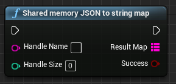
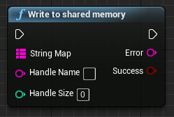
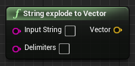

# Lightact-UE4
A set of functionalities enabling integration of Unreal Engine with [Lightact media server](https://lightact-systems.com).

## Installation
**Please note: this plugin has been tested with Unreal Engine 4.19. It does not work (yet) with 4.20.**

### Step 1: Download the plugin
Download the ZIP archive and copy the plugin folder to the *Plugins* folder in your UE project folder. For a more detailed help see [Installing UE plugins video tutorial](https://www.youtube.com/watch?v=85M2BB-Ct9g&list=PLcNPGta1d2XDcSsz8zcW0f2lPSawnW3mR&t=195s&index=2) or [Installing UE4 Plugins User Guide](https://support.lightact-systems.com/installing-ue4-plugins/).

### Step 2: Regenerate project files and build the plugin
When you download the plugin files you need to *Regenerate Visual Studio project files*. You do that by right-clicking on the .uproject file. If you don't see this option, your UE project does not contain any code.
If this is the case you should add a dummy C++ class first to the project.

When you are done, double click on the .uproject file to open it in the UE Editor. Alternatively, open the project through Epic Launcher. You'll probably encounter warnings about missing plugin dll. You should click *Yes* to rebuild the dlls.

### Step 3: Enabling the Plugin
When you are done and the UE Editor opens, make sure the Plugin is enabled. You might need to restart the UE Editor. If you are successful you'll see a new *Lightact* node category in your blueprints.

## Usage
The plugin adds a number of new Blueprint nodes. You'll find them all inside *Lightact* category.

### Nodes for reading from shared memory
#### Shared memory JSON to string map

This node reads from shared memory (*Handle Name*) of size (*Handle Size*). It expects the data to be in JSON format. The data is then converted to *Map of Strings to Strings*.

### Nodes for writing to shared memory
#### Open shared memory

This node is used to create shared memory handle. It should be called once before all other nodes for writing to shared memory. In most cases you'll want to connect it to **Event BeginPlay** node.
#### Write to shared memory

This node is used to write data to shared memory handle. It takes in a *Map of Strings to Strings* and converts it to JSON before writing it to shared memory.
#### Close shared memory

This node is for closing shared memory handle. It should be called once before quitting the game. The *Handle Name* property should be the same as in the *Open shared memory* node. In most cases you'll want to connect it to **Event EndPlay** node.

### Utility nodes
#### String explode to Vector

This node expects a string representing a 3-component vector (standard *vector* variable in UE) and outputs a *vector* variable. It is useful if you want to transfer *Vec3* variable from Lightact to *vector* variable in UE.

## Tips
In most cases you'll use just one *Handle Name* throughout your project as you can send many variables through that handle at the same time. In most cases, you'll connect a single **Open Shared Memory** in your main level blueprint (or elsewhere) and connect it to **BeginPlay** node and use one **Close Shared Memory** and connect it to **EndPlay** node.

## Troubleshooting
If you encounter any build errors, try opening the *.sln* file in Visual Studio and do a *Clean solution* and then *Build solution*. If these 2 actions succeeded you should be able to open the project.

## Additional help
Additional help is available on:
- [Lightact YouTube UE Playlist](https://www.youtube.com/playlist?list=PLcNPGta1d2XDcSsz8zcW0f2lPSawnW3mR)
- [User Guide](https://support.lightact-systems.com/unreal-engine-and-lightact-media-server-integration/)
- [Quick Start Guide](https://support.lightact-systems.com/integrate-lightact-unreal-engine/)
